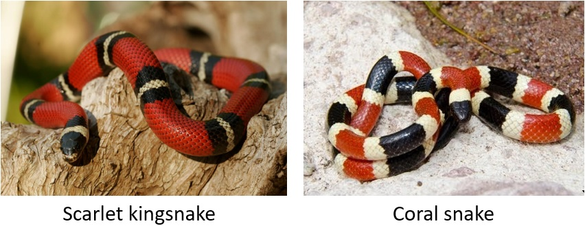

# venomous-or-not

My first attempt at a machine learning API, for those of us who forget the rhyme "red on black friend of jack, red on yellow kill a fellow".

The resulting app is up at https://snake-detector.onrender.com/. Test it out with images of coral snakes and scarlet king snakes.

The app uses a [ResNet-34](https://www.kaggle.com/pytorch/resnet34) convolutional neural network model pre-trained on [ImageNet](http://www.image-net.org/) and trained further on ~250 images scraped from google images.

The notebook `snakes.ipynb` shows how I trained the model, using [fastai](https://github.com/fastai/fastai).

The `Dockerfile` means the entire thing can be deployed to [Zeit Now](https://zeit.co/now) or any other container hosting service.
